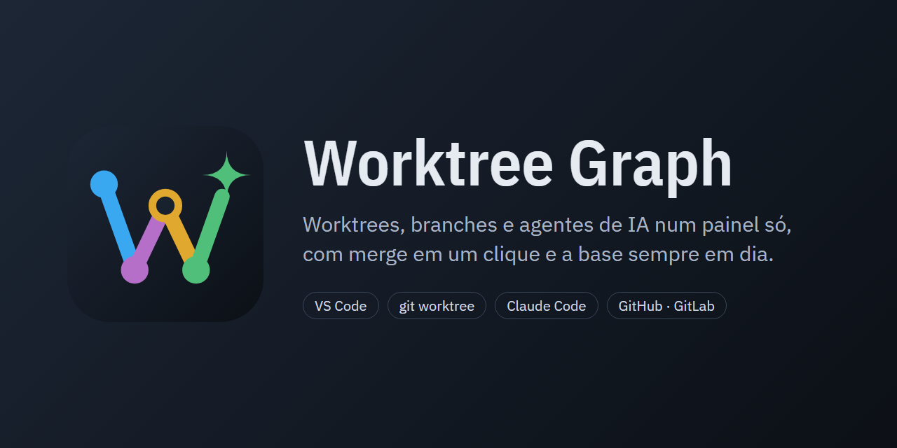
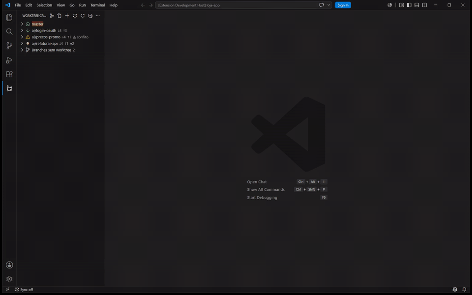
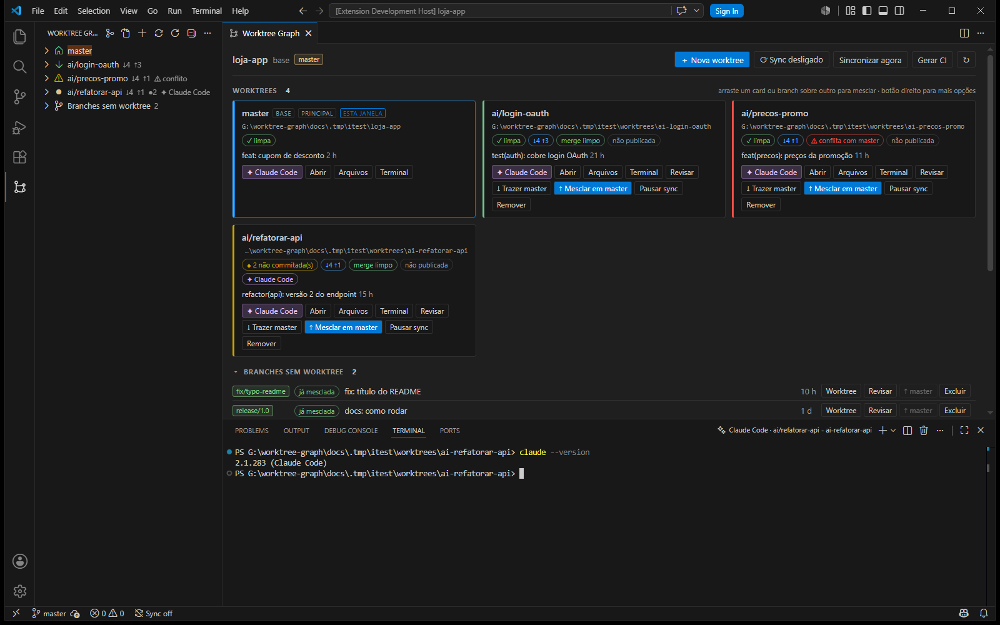
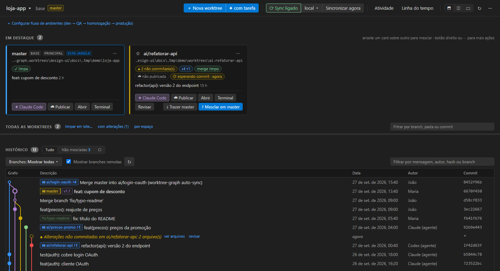

# AgentYard

Extensão do VS Code para quem desenvolve com vários agentes de IA em paralelo, cada um na sua `git worktree`. O AgentYard junta num lugar só o grafo de worktrees e branches, merge e análise de merge, PR/MR com o status da revisão, pipelines, issues (GitHub, GitLab, Bitbucket, Azure DevOps, Jira e Redmine), o Claude Code (ou outro agente) aberto em cada worktree com sessões e uso de tokens, fila e agendamento de tarefas, e o sync da base local ou no CI.

> Antes se chamava **Worktree Graph**. Os IDs de comandos e configurações (`worktreeGraph.*`) continuam os mesmos.





Vídeo em MP4: [docs/video/worktree-graph.mp4](docs/video/worktree-graph.mp4)

**Manual completo:** [docs/MANUAL.md](docs/MANUAL.md)



## O que tem

| | |
|---|---|
| **Cards de worktree** | branch, pasta, alterações não commitadas, `↓atrás ↑à frente` da base, previsão de conflito (`git merge-tree`, sem tocar em nada), upstream e status do sync. |
| **Merge fácil** | `↓ Trazer master`, `↑ Mesclar em master`, arrastar card/branch sobre outro, ou botão direito → *Mesclar em…*. Sempre com confirmação mostrando quantos commits entram e se a simulação prevê conflito. |
| **Branch sem worktree** | o merge acontece numa worktree temporária; se der conflito, nada muda e a extensão oferece criar uma worktree para resolver. |
| **Revisar** | lista os arquivos que a branch mudou desde que saiu da base (inclui o que ainda não foi commitado) e abre cada um num diff. |
| **Agentes no terminal** | botão **✦ Claude Code** em cada card abre o CLI do agente num terminal já dentro da worktree (reaproveita se já estiver aberto). A lista é configurável: Claude Code, Codex, Gemini ou qualquer comando; `{prompt}` pede a tarefa antes de abrir. |
| **Navegar arquivos** | na barra lateral, cada worktree expande em *Não commitadas* (o que está em disco e ainda não virou commit, com diff por arquivo e descarte que mostra o patch antes e guarda uma cópia num stash para desfazer), *Alterações × base* (clique abre o diff) e na árvore de pastas; branches sem worktree também, lidas direto do git. **Arquivos** busca e abre qualquer arquivo de outra worktree sem trocar de janela. |
| **Muitas worktrees** | a lista aparece em ~1 s mesmo com centenas de worktrees; o detalhe chega aos poucos, com barra de progresso. Cards só para a principal, as **favoritas (★)** e as com agente aberto; o resto fica numa tabela com filtro. |
| **Limpeza** | *Limpar worktrees…* remove em lote (já marca as mescladas e limpas); seleção múltipla na árvore; *Remover órfãs* para pastas apagadas. |
| **PR/MR** | *Publicar PR* faz o push e abre o PR (GitHub/GitHub Enterprise) ou MR (GitLab, inclusive self-hosted); o número aparece no card. |
| **Analisar merge** | antes de mesclar: commits que entram, arquivos alterados nos dois lados e conflitos, com o arquivo já mostrando os marcadores. |
| **Fluxo de ambientes** | dev → QA → homologação → produção: o que espera promoção em cada degrau, hotfixes que precisam descer e *Promover* por PR/MR ou merge. |
| **Resolver com Claude** | em worktrees com conflito, um botão abre o agente com a tarefa de trazer a base, resolver, testar e commitar. |
| **Issues** | GitHub, GitLab e Redmine numa view; *Começar com Claude* cria a worktree da issue e abre o agente com o contexto dela. |
| **Vários projetos** | view Projetos: troque o repositório ativo sem abrir outra janela do VS Code. |
| **Sessões do Claude Code** | sessões por worktree (retomar, nova, transcrição), tokens por worktree e uso estimado de 5 h/semana na barra de status. |
| **Nova worktree** | cria branch + pasta a partir da base (ou de qualquer branch/commit) e roda um comando de setup (`npm install`, etc.). |
| **Grafo** | histórico de todas as branches, worktrees (`▣`), remotas e tags, com filtro. |
| **Sync automático** | quando a base anda, mescla nas worktrees que casam com os padrões — só se estiver limpa, sem conflito previsto, e roda um comando de verificação (desfaz o merge se falhar). |
| **CI** | gera `.github/workflows/sync-<base>-into-branches.yml`, que faz o mesmo no GitHub a cada push na base. |

## Instalar

```bash
npm install
npm run compile
npm run package        # gera worktree-graph-0.1.0.vsix
code --install-extension worktree-graph-0.1.0.vsix
```

Para desenvolver: abra a pasta no VS Code e aperte **F5**.

Requer git ≥ 2.38 (previsão de conflito usa `git merge-tree --write-tree`).

## Agentes

```jsonc
"worktreeGraph.agents": [
  { "name": "Claude Code", "command": "claude" },
  { "name": "Claude Code (com tarefa)", "command": "claude {prompt}" },
  { "name": "Codex CLI", "command": "codex" }
],
"worktreeGraph.agentTerminalLocation": "editorBeside"   // panel, editor, editorBeside, split, auto
```

O primeiro da lista é o do botão do card; os outros aparecem no botão direito. Cada terminal
recebe `WTGRAPH_BRANCH`, `WTGRAPH_BASE` e `WTGRAPH_WORKTREE`. Um terminal por worktree e agente:
clicar de novo só traz o terminal para frente.

## Sync automático (local)

Ligue pelo botão **Sync** do painel, pelo ícone na barra da árvore ou pela barra de status. O
estado fica guardado por repositório (não em `settings.json`, para não sujar nenhuma worktree).

**Quando mescla** (`autoSync.trigger`):

- `push` *(padrão)* — a base só entra na branch quando você a envia pela extensão (botão de push,
  *Enviar branches*, publicar PR/MR): antes do `git push`, a base é mesclada na worktree com as
  regras abaixo e o merge vai junto. A verificação periódica só atualiza o estado
  (*atrás (mescla no push)*); *Sincronizar agora* continua mesclando na hora. Se não der para
  mesclar (conflito, worktree suja, testes falharam), o push segue sem o merge e o motivo aparece
  na branch. `git push` feito fora da extensão não dispara o sync.
- `interval` — mescla a cada verificação, como descrito abaixo.

A cada `autoSync.intervalSeconds`, para cada worktree cuja branch casa com `autoSync.branches`:

1. em dia com a base → nada;
2. alterações não commitadas ou merge/rebase em andamento → **espera** (o agente pode estar no meio do trabalho);
3. `git merge-tree` prevê conflito → não mexe, avisa uma vez por commit da base;
4. modo `notify` → só avisa, com botão *Mesclar agora*;
5. senão → `git merge <base>`; se `autoSync.testCommand` estiver definido, roda na worktree e,
   se falhar, desfaz com `git reset --keep` (preserva qualquer edição feita durante os testes).

Com várias janelas abertas no mesmo repositório (uma por worktree), só uma roda o sync: elas
disputam um lock em `<.git>/worktree-graph-sync.lock`.



## Onde o sync roda

O botão **onde** do painel (ou *AgentYard: Escolher onde o sync roda*) define, por repositório:

| modo | o que acontece |
|---|---|
| **Só local** *(padrão)* | a extensão mescla a base nas worktrees desta máquina; o workflow do GitHub não é usado. |
| **Só GitHub Actions** | a extensão não mexe nas worktrees, só mostra o estado; o workflow gerado em **Gerar CI** sincroniza as branches publicadas. |
| **Dividido** | local para branches ainda não publicadas; GitHub Actions para as que têm upstream. Nenhuma branch é sincronizada pelos dois. |
| **Ambos** | local e GitHub Actions em todas as branches (pode gerar dois merges diferentes da mesma base). |

O padrão para repositórios novos vem de `worktreeGraph.autoSync.where`. Ao escolher um modo com
GitHub sem ter o workflow, a extensão oferece gerá-lo.

## Sync no GitHub (CI)

**Gerar CI** pergunta os padrões de branch e o comando de verificação e escreve o workflow. Ele:

- roda a cada push na base (e manualmente, via *workflow_dispatch*);
- lista as branches remotas que casam com os padrões e estão atrás da base;
- para cada uma (matrix): mescla a base, roda a verificação, faz push; conflito ou verificação
  quebrada → não altera a branch e registra no *Summary* da execução.

Push feito com `GITHUB_TOKEN` não dispara outros workflows. Se quiser que o CI da branch rode depois
do sync, use um PAT em `secrets.SYNC_TOKEN` (linha comentada no checkout).

**Local ou CI?** Os dois podem mesclar a mesma base na mesma branch e gerar commits de merge
diferentes. Use o sync local para worktrees ainda não publicadas e o CI para branches
compartilhadas — os padrões (`autoSync.branches`/`exclude`) ajudam a separar.

## GitLab (inclusive self-hosted)

Remotos cujo endereço contém "gitlab" são reconhecidos sozinhos. Para outros hosts:

```jsonc
"worktreeGraph.gitlab.hosts": ["git.empresa.com", "https://git.empresa.com:8443"]
```

*Conectar ao GitHub/GitLab* pede um token pessoal (escopo `api` no GitLab) e o guarda no cofre de
segredos do VS Code. No GitHub.com usa o login do próprio VS Code.

O **Gerar CI** detecta o GitLab e gera `.gitlab/worktree-graph-sync.gitlab-ci.yml`, incluído no
`.gitlab-ci.yml`. Crie a variável `SYNC_TOKEN` (project access token com `write_repository`).

## Configurações

| chave | padrão | |
|---|---|---|
| `worktreeGraph.baseBranch` | *(detecta)* | origin/HEAD → main → master → develop |
| `worktreeGraph.worktreeRoot` | `<repo>.worktrees` | onde novas worktrees nascem (ex.: `G:\worktrees`) |
| `worktreeGraph.postCreateCommand` | | rodado num terminal após criar a worktree |
| `worktreeGraph.agents` | Claude Code, Codex, Gemini | CLIs do botão de agente |
| `worktreeGraph.agentTerminalLocation` | `panel` | `panel`, `editor`, `editorBeside` (ao lado do código), `split` (dividido com o da worktree) ou `auto` (tarefas no painel, sessões ao lado) |
| `worktreeGraph.agentTerminalFocus` | `interactive` | agentes com tarefa abrem sem tirar o foco; `always` ou `never` |
| `worktreeGraph.agentFollowEditor` | `false` | abrir um arquivo de outra worktree traz o terminal de agente dela |
| `worktreeGraph.claude.onSessionEnd` | `ask` | sessão terminou: `ask` (retomar ou fechar), `close` ou `keep` |
| `worktreeGraph.claude.answerFromNotification` | `false` | **Permitir**/**Negar** na notificação de permissão (experimental) |
| `worktreeGraph.claude.connectIde` | `false` | abre o Claude com `--ide` (diffs no editor, seleção, problemas) |
| `worktreeGraph.claude.ideWorkspace` | `ask` | oferece pôr a worktree no workspace para o `/ide` funcionar |
| `worktreeGraph.noFastForwardIntoBase` | `true` | `--no-ff` ao mesclar na base |
| `worktreeGraph.refreshIntervalSeconds` | `15` | atualização do painel |
| `worktreeGraph.statusRefresh.activeSeconds` | `30` | idade máxima do status de worktrees ativas |
| `worktreeGraph.statusRefresh.idleSeconds` | `600` | idade máxima do status das demais |
| `worktreeGraph.gitConcurrency` | `8` | processos git em paralelo |
| `worktreeGraph.graph.maxCommits` | `400` | |
| `worktreeGraph.graph.showRemoteBranches` | `true` | |
| `worktreeGraph.autoSync.enabledByDefault` | `false` | |
| `worktreeGraph.autoSync.where` | `local` | `local`, `github`, `split` ou `both` |
| `worktreeGraph.autoSync.mode` | `merge` | `merge` ou `notify` |
| `worktreeGraph.autoSync.trigger` | `push` | `push` (mescla a base antes do push) ou `interval` (a cada verificação) |
| `worktreeGraph.autoSync.branches` | `["**"]` | `*` = um segmento, `**` = qualquer coisa |
| `worktreeGraph.autoSync.exclude` | `[]` | |
| `worktreeGraph.autoSync.intervalSeconds` | `60` | |
| `worktreeGraph.autoSync.fetchRemote` | `false` | `git fetch` e sincroniza a partir de `origin/<base>` |
| `worktreeGraph.autoSync.testCommand` | | ex.: `npm test` |
| `worktreeGraph.autoSync.testTimeoutSeconds` | `900` | |
| `worktreeGraph.autoSync.rollbackOnTestFailure` | `true` | |

## Testes

```bash
node test/run.js                 # integração num VS Code real, perfil isolado
node scripts/test-sync.js <repo> # sync contra um repositório, sem VS Code
node test/hosting.test.js        # GitHub/GitLab contra um servidor falso
bash test/ci.test.sh             # executa o job de GitLab CI gerado contra a demo
```

## Scripts

- `scripts/make-demo.sh` — cria um repositório de demonstração com worktrees "de agentes" (uma limpa, uma suja, uma que conflita).
- `scripts/test-sync.js <repo> [teste] [status.json]` — roda o sync de verdade contra um repositório, sem VS Code.
- `scripts/make-prints.sh` — regera `docs/prints/` renderizando o painel num Edge headless.
- `scripts/make-video.sh` — grava o roteiro de `test/suite.js` num VS Code real e gera `docs/video/` (precisa de ffmpeg).
