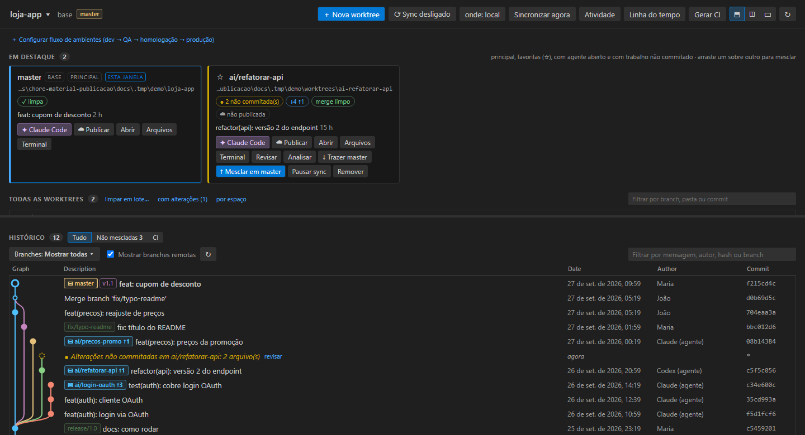
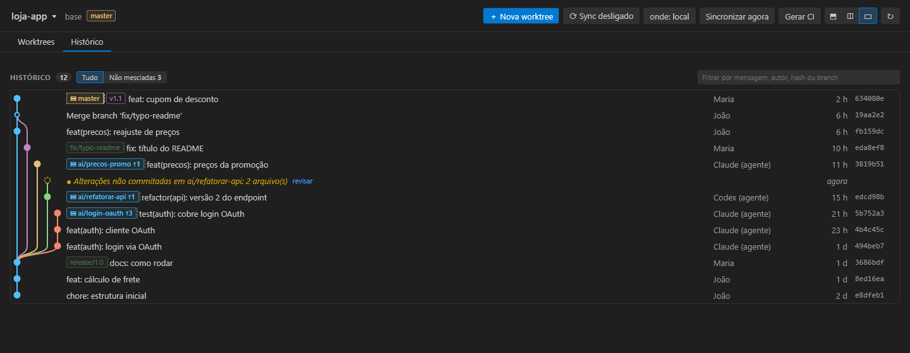
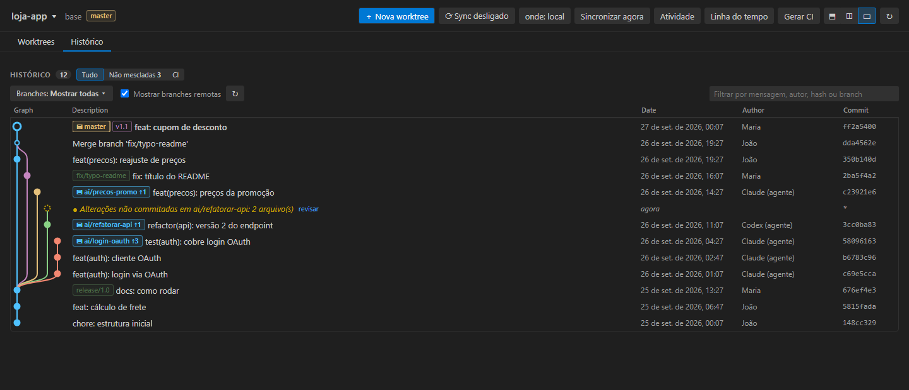
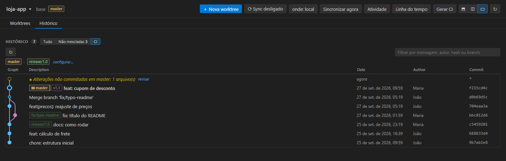
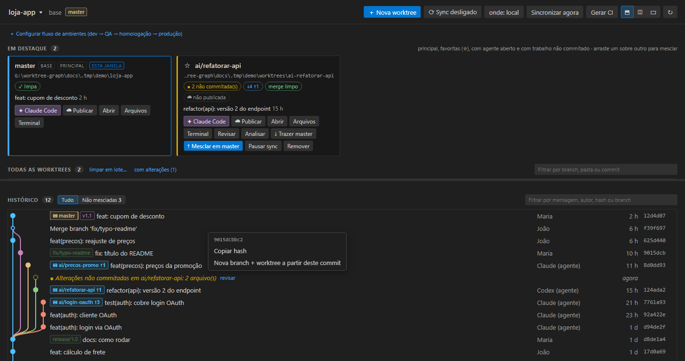

# Manual do AgentYard

Guia de uso da extensão, organizado pelo que você quer fazer. Para a lista resumida de recursos,
veja o [README](../README.md); para o que mudou em cada versão, o [CHANGELOG](../CHANGELOG.md).

> Todos os comandos citados aqui estão na paleta (**Ctrl+Shift+P**) com o prefixo **AgentYard:**.
> Os IDs internos continuam `worktreeGraph.*` (nome antigo da extensão).

## Sumário

1. [Instalação e requisitos](#1-instalação-e-requisitos)
2. [Primeiros passos](#2-primeiros-passos)
3. [Onde fica cada coisa](#3-onde-fica-cada-coisa)
4. [Worktrees](#4-worktrees)
5. [Agentes (Claude Code, Codex, Gemini…)](#5-agentes-claude-code-codex-gemini)
6. [Tarefas: fila, lote, modelos, agendamentos e projetos longos](#6-tarefas-fila-lote-modelos-agendamentos-e-projetos-longos)
7. [Revisar o que o agente fez](#7-revisar-o-que-o-agente-fez)
8. [Merge](#8-merge)
9. [Remoto: push, pull, PR/MR e pipelines](#9-remoto-push-pull-prmr-e-pipelines)
10. [Issues](#10-issues)
11. [Histórico (grafo de commits)](#11-histórico-grafo-de-commits)
12. [Sync automático da base](#12-sync-automático-da-base)
13. [Fluxo de ambientes](#13-fluxo-de-ambientes)
14. [Proteção e checagens](#14-proteção-e-checagens)
15. [Claude Code: sessões, uso e configuração](#15-claude-code-sessões-uso-e-configuração)
16. [Ambiente por worktree (portas, .env, dependências)](#16-ambiente-por-worktree-portas-env-dependências)
17. [Limpeza](#17-limpeza)
18. [Métricas e entrega](#18-métricas-e-entrega)
19. [Vários projetos](#19-vários-projetos)
20. [Conectar às plataformas](#20-conectar-às-plataformas)
21. [Referência de configurações](#21-referência-de-configurações)
22. [Problemas comuns](#22-problemas-comuns)

---

## 1. Instalação e requisitos

- **VS Code** 1.85 ou mais novo.
- **git 2.38** ou mais novo (a previsão de conflito usa `git merge-tree --write-tree`).
- Para os agentes: o CLI instalado e no `PATH` (`claude`, `codex`, `gemini`…).

Instale pelo `.vsix`:

```bash
code --install-extension worktree-graph-<versão>.vsix
```

Ou gere o pacote a partir do código:

```bash
npm install
npm run compile
npm run package
```

A extensão ativa sozinha em qualquer pasta que tenha `.git`.

## 2. Primeiros passos

1. Abra um repositório git no VS Code.
2. Clique no ícone do **AgentYard** na barra de atividades (a lateral esquerda).
3. Rode **AgentYard: Abrir grafo** para abrir o painel principal.
4. Crie uma worktree para uma tarefa: **Nova worktree** (botão `+` na view Worktrees ou na paleta).
   Informe o nome da branch; a pasta nasce em `<repo>.worktrees/<nome>`.
5. No card da worktree, clique em **✦ Claude Code**: o agente abre num terminal já dentro da pasta.
6. Quando o agente terminar, o card mostra **✓ Pronto para revisar**. Clique para ver o resumo e
   use **Revisar**, **Analisar merge** e **Mesclar em `<base>`** ou **Publicar PR/MR**.

A branch base é detectada sozinha (`origin/HEAD` → `main` → `master` → `develop`). Para fixar, use
`worktreeGraph.baseBranch`.



## 3. Onde fica cada coisa

### Painel principal (webview)

Aberto por **Abrir grafo**. Tem duas áreas — **Worktrees** e **Histórico** — que podem ficar
empilhadas, lado a lado ou em abas (botão de layout na barra do topo; o divisor é arrastável e a
escolha fica salva).

Barra do topo, da esquerda para a direita:

| botão | o que faz |
|---|---|
| nome do projeto ▾ | troca o projeto ativo |
| **Sync** | liga/desliga o sync automático da base (por repositório) |
| **onde** | escolhe onde o sync roda: local, CI, dividido ou ambos |
| **Sincronizar agora** | roda o sync uma vez |
| **☁↓ Trazer n** | pull em lote das branches com novidades no remoto |
| **☁↑ Enviar n** | push em lote das branches com commits não enviados |
| **Atividade** | commits, sessões, tokens e custo do dia |
| **PRs/MRs** | abre a view Pull requests |
| **Linha do tempo** | nascimento, PR e merge de cada branch |
| **Gerar CI** | gera o workflow de sync para GitHub Actions ou GitLab CI |
| **Conectar** | login no GitHub/GitLab/etc. do remoto |
| layout · ⟳ | layout do painel e atualizar |

### Cards e tabela

- **Cards**: a worktree principal, as **favoritas (★)** e as que têm agente aberto.
- **Tabela**: todas as outras, com filtro por texto, filtro "só com alterações" e ordenação por
  espaço em disco.
- Botão direito num card ou linha mostra todas as ações.

Cada card mostra: branch, pasta, alterações não commitadas, `↓atrás ↑à frente` da base, previsão de
conflito, situação no remoto (`☁`), PR/MR com o status da revisão, último pipeline, sessões e tokens
do Claude, porta, orçamento, fila de tarefas e estado do sync (`⟳`).

Chips de revisão do PR/MR: **✓** aprovado, **✎** mudanças pedidas, **◷** aguardando, **💬**
conversas abertas.

### Barra lateral (views)

| view | conteúdo |
|---|---|
| **Projetos** | repositórios adicionados; troca o ativo |
| **Worktrees** | cada worktree expande em *Alterações × base*, árvore de pastas e *Stashes*; branches sem worktree também |
| **Issues** | issues do GitHub, GitLab, Bitbucket, Azure DevOps, Jira e Redmine |
| **Sessões Claude** | sessões do Claude Code agrupadas por worktree |
| **Claude: configuração** | skills, comandos, permissões, modelo, hooks e memória |
| **Pipelines** | GitHub Actions, GitLab CI, Bitbucket Pipelines, Azure Pipelines |
| **Fila de tarefas** | tarefas esperando cada worktree |
| **Agendamentos** | tarefas recorrentes para os agentes |
| **Fila de merge** | branches esperando para entrar na base, uma por vez |
| **Pull requests** | PRs/MRs do remoto agrupados |

Na barra de status: uso estimado do Claude Code (janela de 5 h e semana) e atalho para o sync.

## 4. Worktrees

### Criar

**Nova worktree** pede o nome da branch e o ponto de partida (a base, qualquer branch ou um
commit). Depois de criada:

- roda `worktreeGraph.postCreateCommand`, se definido (ex.: `npm install`);
- senão, trata as dependências Node conforme `worktreeGraph.setup.nodeModules`
  (`ask`, `install` ou `link` — compartilhar o `node_modules` da principal);
- aplica portas e `.env` se `worktreeGraph.env.ports` estiver configurado (ver seção 16).

Onde as pastas nascem: `worktreeGraph.worktreeRoot` (padrão `<repo>.worktrees` ao lado do repo).

Também dá para criar worktree a partir de um commit do histórico, de uma issue ou de um PR/MR.

### Checkout parcial e submódulos

Em monorepo, a worktree de um agente só precisa das pastas da tarefa. **Nova worktree com checkout
parcial (monorepo)…** (menu ⋯ da view Worktrees) pergunta as pastas antes de criar; **Checkout
parcial (sparse): escolher pastas…** muda uma worktree que já existe (nenhuma pasta = volta ao
checkout completo). Os arquivos da raiz sempre vêm. `worktreeGraph.worktree.sparseDepth` define
quantos níveis de pasta aparecem na lista.

Se o repositório tem submódulos, a worktree nova já sai com `git submodule update --init
--recursive` (`worktreeGraph.worktree.submodules`).

### Branches empilhadas

Para dividir uma tarefa grande em PRs menores, um em cima do outro: **Nova worktree empilhada sobre
esta branch…** (menu da worktree, ou Worktree → ↳ no painel). O card mostra `↳ pai`, e o PR da
branch já sugere o pai como destino.

Quando o pai recebe commits, aparece `↻` e o AgentYard oferece o **Restack**: leva só os commits da
branch (e das que estão em cima dela) para cima do pai, com `git rebase --onto`. Quando o pai entra
na base, a branch passa a sair da base e o destino do PR/MR muda sozinho. Conflito desfaz o rebase
e oferece resolver com o agente; branches já enviadas pedem **Enviar (force-with-lease)**.
`worktreeGraph.stack.autoRestack`: `ask` (padrão), `auto` ou `off`. **Empilhar sobre outra
branch…** liga uma branch que já existe a um pai; **Ver a pilha** mostra a sequência.

### Abrir e navegar

- **Abrir em nova janela**: outra janela do VS Code na worktree.
- **Abrir terminal na worktree**.
- **Abrir arquivo de outra worktree…**: busca e abre um arquivo sem trocar de janela.
- Na view Worktrees, a árvore de pastas funciona como a do Explorer: letras do git (M/U/A/D),
  abrir ao lado, revelar no sistema, copiar caminho, **Comparar com a base** e **Adicionar ao
  Explorer** (vira pasta do workspace multi-root).

### Favoritar

**★** no card ou na árvore: a worktree vira card e sobe na lista.

### Stash e mover alterações

No grupo **Stashes** de cada worktree: guardar, aplicar em…, aplicar e remover (pop), ver diff e
apagar. **Mover alterações para outra worktree…** leva o trabalho não commitado de uma para outra.

### Comparar

**Comparar com outra branch/worktree…** abre a lista de arquivos diferentes entre duas branches.

## 5. Agentes (Claude Code, Codex, Gemini…)

### Abrir

- **✦ Claude Code** no card abre o primeiro agente de `worktreeGraph.agents`.
- Botão direito no card → outros agentes.
- **Abrir agente com uma tarefa** pede o texto antes de abrir.

Um terminal por worktree e agente: clicar de novo só traz o terminal para frente.
`worktreeGraph.agentTerminalLocation` escolhe onde o terminal abre: `panel` (painel de terminais),
`editor` (aba no grupo ativo), `editorBeside` (aba ao lado do código), `split` (no painel, dividido
com o outro terminal de agente da mesma worktree) ou `auto` (tarefas no painel, sessões interativas
ao lado do código). Agentes abertos com uma tarefa não tiram o foco de onde você está
(`worktreeGraph.agentTerminalFocus`).

### Organizar os terminais

- Na view de agentes abertos: **Mover para o editor** / **Mover para o painel**, **Interromper o
  Claude (Esc)** e, no grupo da worktree ou no título da view, **Agentes lado a lado no editor**
  (até 4 colunas; com mais, você escolhe quais).
- `worktreeGraph.agentFollowEditor`: abrir um arquivo de outra worktree traz para frente o terminal
  de agente dela que está no painel, sem tirar o foco do editor.
- A barra de status acompanha a worktree do arquivo aberto: com um agente ali, mostra o estado dele
  ("Claude Code · feat/x · trabalhando") e o clique leva ao terminal; sem agente, abre um.
- `Ctrl+Alt+Shift+J` vai ao Claude que está esperando você.

### Mandar contexto ao Claude

- **Enviar ao Claude (@menção)** (`Ctrl+Alt+Shift+K` no editor): o arquivo e as linhas selecionadas.
- **Enviar problemas ao Claude** (menu do editor): os erros e avisos do arquivo (ou da seleção) numa
  linha, com `@arquivo#L`.
- **Enviar diff da worktree ao Claude** (grupo da view de agentes, paleta): tudo o que a branch mudou
  desde a base, commitado ou não, num arquivo `.diff` mencionado.
- **Enviar seleção do terminal ao Claude** (menu do terminal, `Ctrl+Alt+Shift+K` com texto
  selecionado): a saída de um teste ou build, num arquivo mencionado.

Nada disso aperta Enter: você completa a mensagem.

### Permissões, fim da sessão e `/ide`

- `worktreeGraph.claude.answerFromNotification` (experimental) põe **Permitir** e **Negar** na
  notificação de um pedido de permissão.
- Quando uma sessão termina e você não está olhando para o terminal, a extensão oferece **Retomar
  aqui** (o mesmo terminal, com `--resume`) ou **Fechar terminal** (`worktreeGraph.claude.onSessionEnd`).
- O Claude só se conecta ao VS Code (`/ide`: diffs no editor, seleção e problemas) quando a pasta
  dele está dentro do workspace. Com a extensão do Claude Code instalada, abrir um Claude numa
  worktree fora do workspace oferece adicioná-la como pasta (`worktreeGraph.claude.ideWorkspace`).
  `worktreeGraph.claude.connectIde` abre o Claude com `--ide` para conectar já ao abrir.

### Abrir com opções

**Abrir Claude Code com opções (modelo, modo de permissão)…** pergunta o modelo (`opus`, `sonnet`,
`haiku` ou outro), o modo de permissão (`plan` para ele só planejar antes, `acceptEdits`, `auto`) e a
tarefa, e lembra a última escolha. `worktreeGraph.claude.extraArgs` acrescenta argumentos a todo
Claude aberto pela extensão; `worktreeGraph.claude.appendSystemPrompt` vai como
`--append-system-prompt` nesse comando.

### Configurar a lista

```jsonc
"worktreeGraph.agents": [
  { "name": "Claude Code", "command": "claude", "promptCommand": "claude {prompt}" },
  { "name": "Codex CLI", "command": "codex", "promptCommand": "codex {prompt}" },
  { "name": "Meu script", "command": "./agente.sh {prompt}" }
]
```

- `command`: o que roda ao clicar. Com `{prompt}`, a extensão pede a tarefa antes.
- `promptCommand`: usado quando a extensão já tem a tarefa pronta (resolver conflito, issue, fila…).
- O terminal recebe as variáveis `WTGRAPH_BRANCH`, `WTGRAPH_BASE` e `WTGRAPH_WORKTREE`.
- A tarefa vai por arquivo e entra como um único argumento, então aspas e quebras de linha
  funcionam em PowerShell, bash e cmd.

### Quando o agente termina

A extensão detecta o fim pelo shell integration do terminal ou, se não der, por
`worktreeGraph.agents.idleMinutes` sem mudança no HEAD e no índice. Se ficaram commits novos e a
worktree está limpa, aparece **✓ Pronto para revisar**, com o resumo (commits, arquivos, +/−) e
os botões **Revisar**, **Analisar merge** e **Publicar**.

- `worktreeGraph.agents.notifyReady`: notificação ao ficar pronto.
- `worktreeGraph.readySummary.useAgent`: também pede ao agente um resumo (o que mudou, riscos, o
  que testar) em `.worktree-graph/summary.md`.
- **Tirar "pronto para revisar"** limpa o aviso.

### Tentar N abordagens

**Tentar N abordagens…** (ou a partir de uma issue) cria várias worktrees `try/*` com a mesma
tarefa e um agente em cada. **Comparar tentativas…** mostra as diferenças lado a lado; escolha uma
e descarte as outras.

### Sobreposição entre worktrees

O card avisa quando duas worktrees mexem nos mesmos arquivos (risco de conflito entre agentes).
**Ver sobreposição de arquivos entre worktrees** lista tudo.

### Orçamento por worktree

`worktreeGraph.budget.perWorktreeTokens` e/ou `perWorktreeUsd` definem um limite. O aviso sai aos
80% e aos 100%. Com `worktreeGraph.budget.action: "pause-queue"`, a worktree que estourou deixa de
receber tarefas da fila e dos agendamentos.

## 6. Tarefas: fila, lote, modelos, agendamentos e projetos longos

### Fila de tarefas

**Adicionar tarefa para o agente…** enfileira uma tarefa numa worktree. Quando o agente termina a
atual, a próxima vai sozinha (`worktreeGraph.tasks.autoAdvance`). Na view **Fila de tarefas**:
rodar agora, subir/descer, remover, marcar como pronta/falhou e limpar as terminadas.

### Tarefa em lote

**Enviar tarefa para várias worktrees…** manda a mesma tarefa para várias worktrees. No máximo
`worktreeGraph.batch.maxParallel` agentes abertos ao mesmo tempo; os outros esperam vaga.

### Modelos de tarefa

**✦ Usar modelo de tarefa…** oferece modelos prontos (corrigir testes, atualizar dependências,
escrever testes para o arquivo aberto, revisar e simplificar o diff, documentar a branch,
investigar erro) e os do projeto.

Modelos do projeto ficam em `.agentyard/templates/<id>.md`:

```markdown
---
name: Migrar para a API nova
description: troca chamadas da v1 pela v2
---
Na branch ${branch}, troque as chamadas da API v1 pela v2 em ${file}. Rode os testes.
```

Placeholders: `${branch}`, `${base}`, `${file}`, `${selection}`, `${issue}`. **Novo modelo de
tarefa…** e **Editar modelo de tarefa…** criam e abrem esses arquivos. Também dá para listar
modelos em `worktreeGraph.taskTemplates`.

### Agendamentos

**Novo agendamento…** (view **Agendamentos**) manda uma tarefa a um agente em horários definidos.

Quando — cron de 5 campos ou um atalho:

| atalho | equivale a |
|---|---|
| `todo dia às 09:00` | `0 9 * * *` |
| `dias úteis às 8h30` | `30 8 * * 1-5` |
| `toda segunda às 10:00` | `0 10 * * 1` |
| `a cada 2 h` | `0 */2 * * *` |
| `a cada 30 min` | `*/30 * * * *` |
| `de hora em hora` | `0 * * * *` |
| `uma vez em 2026-10-01 14:00` | uma única execução |

Onde: uma branch existente, uma worktree nova a cada execução, ou todas as branches de um padrão.
Condições opcionais: só se a worktree estiver limpa, só se a base andou. Horário perdido com o VS
Code fechado: executar uma vez ao abrir, ou pular.

Com várias janelas abertas, só uma executa os agendamentos de cada repositório. Na view: editar,
duplicar, pausar/retomar, executar agora, histórico e excluir.

### Projetos longos

Para o que não cabe numa sessão do agente. **Novo projeto longo…** (view **Projetos longos**, ou
no menu da worktree) pede o objetivo, o comando de verificação (vem de `autoSync.testCommand` ou
do projeto: `npm test`, `cargo test`, `pytest`…) e se para para revisão a cada marco ou avança sozinho.

1. **Planejamento.** O Claude abre só para planejar: explora o código, pergunta o necessário e
   escreve `.agentyard/projects/<projeto>/PLAN.md`. Cada marco é um título `## [M1] Título` com
   um checklist `- [ ]`. Quando o plano tem marcos, aparece **Iniciar marco [M1]**.
2. **Um marco por sessão.** Cada marco abre uma sessão nova do Claude, com contexto limpo. A
   memória está nos arquivos: o hook `SessionStart` injeta o objetivo, os marcos, o checklist do
   marco atual, as últimas entradas do `PROGRESS.md` e as regras, também depois de compactar ou retomar.
3. **Portão no Stop.** O agente só consegue parar quando: o checklist do marco está todo marcado
   no PLAN.md, o PROGRESS.md ganhou uma entrada neste turno, não há nada sem commit e a verificação
   passa. Se faltar algo, o motivo (com as últimas linhas da verificação que falhou) volta para o
   agente, que continua. Se ele depende de uma pessoa, escreve `BLOCKED.md` na pasta do projeto e para.
4. **Próximo marco.** Com o portão liberado, o marco fica feito e o próximo começa numa sessão
   nova, ou espera sua revisão ("Revisar alterações" / "Iniciar [M2]").

O projeto pausa e avisa quando: o portão barrou `longProjects.gateRetries` vezes seguidas, o marco
já teve `longProjects.maxSessionsPerMilestone` sessões sem terminar, o orçamento da worktree
acabou (`budget.action: pause-queue`), o terminal do marco foi fechado ou o agente escreveu o
BLOCKED.md. Um marco rodando há mais de `longProjects.milestoneMinutes` gera um aviso.

Na view: marcos com o checklist, tempo e tokens de cada um; iniciar/continuar, pausar, ir para o
terminal, rodar a verificação, abrir plano e diário, planejar de novo, refazer um marco numa
sessão nova e marcar como feito. PLAN.md, PROGRESS.md e project.json são commitados na branch; o
estado de execução fica na extensão. O projeto só aparece na worktree da branch que o criou.
Precisa do Claude Code com `claude.trackState` ligado (usa os hooks dele).

## 7. Revisar o que o agente fez

- **Revisar alterações contra a base**: lista os arquivos que a branch mudou desde que saiu da
  base (inclui o não commitado); cada um abre num diff.
- Na view Worktrees, o grupo *Alterações × base* faz o mesmo na árvore.
- **✦ Revisar PR/MR com o agente**: o agente revisa o PR/MR e os comentários aparecem num painel;
  você escolhe o que postar no GitHub/GitLab. **Abrir a última revisão do agente** reabre o painel.
- Commits do histórico: **✦ Explicar com o agente** (ver seção 11).

### Turnos do agente (checkpoints)

No começo e no fim de cada turno do Claude (do prompt até a resposta terminar), o AgentYard guarda o
estado da worktree num commit solto em `refs/agentyard/turns` — sem mexer no índice, no stash nem na
branch. Na view **Agentes abertos**, cada terminal expande nos turnos, com arquivos e `+/−`:

- clicar abre **o que mudou naquele turno** (todos os arquivos numa aba só);
- **Restaurar os arquivos para antes deste turno** (ou depois) volta só os arquivos, com **Desfazer**.

**Turnos do agente (checkpoints)…** no menu da worktree lista os turnos de todas as sessões dali.
Os checkpoints ficam 7 dias (`worktreeGraph.claude.checkpointDays`); desligue com
`worktreeGraph.claude.checkpoints`.

### Quem escreveu esta linha

Os commits feitos durante um turno ganham uma nota git local (`refs/notes/agentyard`) com a sessão,
o turno e o prompt. No editor, botão direito → **Qual sessão de agente escreveu esta linha?** mostra
o commit e abre a transcrição da sessão (`worktreeGraph.claude.commitNotes`).

### Revisão local para o agente

Como num PR, mas antes de publicar: nos arquivos de uma worktree, clique no **+** da margem do
editor para comentar uma linha (ou um trecho). Os comentários se acumulam (a barra de status mostra
quantos); **✦ Mandar os comentários da revisão ao agente** manda tudo numa tarefa só para o Claude
daquela worktree — se ele já está aberto e parado, recebe uma linha e lê os comentários pela
ferramenta MCP `review_comments`.

## 8. Merge

### Formas de mesclar

- **↓ Trazer `<base>`**: `git merge <base>` na worktree.
- **↑ Mesclar em `<base>`**: mescla a branch na base (com `--no-ff` por padrão,
  `worktreeGraph.noFastForwardIntoBase`).
- **Mesclar esta branch em…**: escolhe o destino.
- **Arrastar** um card ou branch sobre outro.



Sempre há confirmação com quantos commits entram e se a simulação prevê conflito. Se a branch de
destino não tem worktree, o merge acontece numa worktree temporária; se der conflito, nada muda e a
extensão oferece criar uma worktree para resolver.

### Analisar antes

**Analisar merge…** abre um painel com os commits que entram, os arquivos (marcando os alterados
nos dois lados) e os conflitos previstos. Cada conflito abre como o arquivo ficaria depois do
merge, com os marcadores. Nada é alterado.

### Resolver conflito com o agente

Em worktrees com conflito previsto aparece **✦ Resolver com Claude**: o agente abre com a tarefa de
trazer a base, resolver, rodar os testes e commitar. Se a branch não tem worktree, ela é criada
antes. O texto da tarefa está em `worktreeGraph.prompts.resolveConflict` e
`worktreeGraph.prompts.mergeIntoBase`.

### Fila de merge

Para várias branches prontas ao mesmo tempo: **Pôr na fila de merge**. A fila mescla uma por vez,
trazendo a base antes e rodando as checagens. Dá para pôr várias de uma vez: selecione as
worktrees na árvore (Ctrl/Shift+clique) e use **Pôr na fila de merge**, ou clique no **+** da view
e marque as branches na lista (entram na ordem em que aparecem). O painel **Analisar merge** também
tem **Pôr na fila de merge**, e o aviso "✓ Pronto para revisar" de um agente tem **Pôr na fila de
merge → base**.

Se uma branch conflitar com a base ou falhar nas checagens, a fila abre o Claude Code (o primeiro
agente configurado) na worktree dela com a tarefa de trazer a base, resolver e commitar; o item
fica **com o agente** e a fila espera. Quando ele termina e commita, a fila tenta de novo a mesma
branch, mescla e segue para a próxima. Se o terminal for fechado sem commit, ou se a mesma branch
precisar do agente mais de duas vezes, ela sai da fila com o motivo. Worktree com mudanças não
commitadas não é entregue ao agente. **Processar a fila agora** volta a tentar os itens que estavam
com o agente (útil depois de recarregar a janela). Desligue com
`worktreeGraph.mergeQueue.resolveWithAgent` para a fila só parar no conflito, como antes.

Para a fila andar sozinha, use **Pôr na fila de merge (Claude resolve os conflitos)** (menu da
worktree, do grafo, **…** da view **Fila de merge**, painel **Analisar merge** ou o aviso de
pronto para revisar). Quando essa branch parar, o Claude já abre autorizado — no modo de
`worktreeGraph.mergeQueue.authorizedPermissionMode` (padrão `auto`; `acceptEdits` ainda pergunta
antes de comandos; `bypassPermissions` aprova tudo) — e com a instrução de não parar para
perguntar, decidindo e explicando no commit. Na view, o item aparece com **✦ autorizado**; clique
com o botão direito para autorizar ou desautorizar um item que já está na fila.

Na view **Fila de merge**: subir/descer, tirar, pausar/retomar, processar agora e limpar.
`worktreeGraph.mergeQueue.pushBase` faz push da base depois de cada merge.

### Achar o commit que quebrou (bisect)

**Achar o commit que quebrou (bisect)…** (menu da worktree, ou Git no painel) pergunta o commit
quebrado (padrão `HEAD`), o último que funcionava (onde a branch saiu da base, tags ou commits
recentes) e um comando de teste (saída 0 = funciona). O `git bisect run` roda numa worktree
temporária, sem mexer nas suas nem nas dos agentes, e no fim oferece **✦ Explicar com o agente**.
Sem comando, o agente conduz o bisect numa worktree temporária própria.

### Commit com mensagem do Claude

**✦ Commitar com mensagem escrita pelo Claude…** manda o diff (o que está no stage, ou tudo) e as
últimas mensagens do repositório para o Claude sem terminal (`claude -p`), que escreve no mesmo
estilo; você revisa antes do commit. Modelo em `worktreeGraph.claude.headlessModel` (padrão `haiku`).

### Cherry-pick e reorganizar commits

- Arraste um commit do histórico sobre uma branch, ou **Cherry-pick de um commit em…**.
- **Reorganizar commits…**: reordenar, juntar (squash/fixup), mudar mensagem e descartar, sem
  editor. Há backup e **Desfazer a última reorganização de commits**.

## 9. Remoto: push, pull, PR/MR e pipelines

### Push

- **☁ Push ↑n** no card quando há commits não enviados.
- **☁ Publicar** (`push -u`) para branches que ainda não existem no remoto.
- Push recusado: a extensão oferece trazer do remoto e tentar de novo, ou forçar com
  `--force-with-lease`.
- **☁↑ Enviar n** na barra: push em lote, com a lista já marcada.

O remoto usado é `worktreeGraph.remote` (padrão `origin`).

### Pull e fetch

- **☁↓ Trazer** por branch: fast-forward; se divergir, pergunta merge ou rebase. Worktree suja
  pode guardar num stash e devolver depois.
- **☁↓ Trazer n**: em lote.
- **Fetch agora**, ou automático com `worktreeGraph.fetch.intervalMinutes`.

### Publicar PR/MR

**Publicar PR/MR…**: faz o push, sugere título e descrição a partir dos commits e permite abrir
como rascunho. `PR #12` / `MR !5` aparece no card, na tabela e na árvore. Se a branch veio de uma
issue, a descrição ganha `Closes #N` ou `Refs #N`.

### View Pull requests

Grupos **Meus**, **Pedem minha revisão**, **Abertos** e **Mesclados (7 dias)**, com revisão, CI,
conflitos, rascunho e se já existe worktree local. Ao expandir: comentários recentes e checks.

Ações: abrir no navegador, **Trazer para uma worktree** (inclusive PR de fork no GitHub, como
`pr/N`), revisar arquivos, ✦ revisar com o agente, analisar merge, **Mesclar PR/MR…** pela API
(método em `worktreeGraph.pullRequests.mergeMethod`), marcar pronto / converter em rascunho,
copiar link e filtrar.

No painel, clicar no chip do PR abre o PR nesta view; **Ctrl/Alt+clique** abre no navegador.

GitHub e GitLab têm todas as ações; Bitbucket e Azure DevOps, a listagem.

### Comentários da revisão → agente

No PR/MR (view Pull requests), na worktree ou no painel (Agente → **Mandar os comentários da revisão
ao agente**): as conversas não resolvidas e as revisões com texto vão como tarefa para o Claude da
worktree — que traz a branch, se preciso. Quando o agente termina, o AgentYard oferece **Enviar e
resolver**: faz o push, responde "resolvido em <commit>" em cada conversa e marca como resolvida.
GitHub e GitLab. Texto da tarefa em `worktreeGraph.prompts.prFeedback`.

Com `worktreeGraph.pullRequests.describeWithClaude`, **Publicar PR/MR** pede ao Claude título e
descrição a partir dos commits e do diff.

### Pipelines

View **Pipelines**: execuções por branch (só com worktree ou todas), jobs, log, re-executar
(inclusive só os que falharam), cancelar, **Rodar pipeline numa branch…** e iniciar job manual.

O último pipeline de cada branch aparece no card. Quando um pipeline falha,
**✦ Corrigir com o agente** abre o agente na worktree com o final do log
(`worktreeGraph.prompts.fixPipeline`).

Com `worktreeGraph.pipelines.onFailure` = `agent`, um pipeline que falha numa worktree com um Claude
aberto e parado vai direto para ele (que lê o log pela ferramenta `ci_status`); sem Claude parado,
aparece a notificação de sempre.

## 10. Issues

A view **Issues** mostra as suas ou todas (botão na barra da view).

- **Começar com Claude**: cria branch (`issue/<n>-<título>`, prefixo em
  `worktreeGraph.issues.branchPrefix`) e worktree, e abre o agente com o contexto da issue
  (`worktreeGraph.prompts.issue`).
- **Criar worktree sem agente**, **Ver issue**, **Abrir no navegador**, **Copiar link**.
- **Começar trabalho numa issue…** pela paleta.
- **Nova issue…** cria no provedor do projeto.
- **Criar issue com a seleção**: botão direito numa seleção do editor; leva arquivo, linhas e
  código. A notificação oferece **✦ Começar com Claude**.

Provedores: GitHub, GitLab, Bitbucket, Azure DevOps (work items), Jira e Redmine — ver seção 20.

## 11. Histórico (grafo de commits)

Colunas Graph, Description, Date, Author e Commit. Clique num commit para ver os detalhes logo
abaixo: pais, autor, mensagem completa, arquivos com +/− e diff.



Filtros (salvos por projeto):

- **Tudo** / **Não mescladas** (padrão): só os commits que ainda não entraram na base, com o ponto
  de saída de cada branch.
- **CI**: só as branches que o CI usa (fluxo, base, arquivos de GitHub Actions, GitLab CI,
  Bitbucket Pipelines, Azure Pipelines e `worktreeGraph.ciBranches`).
- **Branches:** escolhe quais branches aparecem; **Mostrar branches remotas**; busca.



Botão direito ou duplo clique num commit: ver alterações, **✦ Explicar com o agente**, abrir no
GitHub/GitLab, copiar hash/mensagem, criar branch/tag/worktree, cherry-pick em…, reverter e voltar
uma branch até o commit (com backup e Desfazer).



## 12. Sync automático da base

Mantém as worktrees em dia com a base sem você precisar lembrar.

Ligue pelo botão **Sync** do painel, pela view Worktrees ou pela barra de status. O estado vale
por repositório. A cada `autoSync.intervalSeconds`, para cada worktree cuja branch casa com
`autoSync.branches` (e não com `autoSync.exclude`):

1. em dia com a base → nada;
2. alterações não commitadas ou merge/rebase em andamento → espera;
3. conflito previsto → não mexe e avisa uma vez por commit da base;
4. modo `notify` → só avisa, com **Mesclar agora**;
5. senão → `git merge <base>`; se `autoSync.testCommand` estiver definido, roda na worktree e,
   se falhar, desfaz com `git reset --keep`.

**Pausar/retomar sync desta branch** exclui uma branch temporariamente.

### Onde o sync roda

O botão **onde** escolhe, por repositório:

| modo | o que acontece |
|---|---|
| **Só local** | a extensão mescla nas worktrees desta máquina |
| **Só CI** | a extensão só mostra; o workflow gerado sincroniza as branches publicadas |
| **Dividido** | local para branches não publicadas; CI para as que têm upstream |
| **Ambos** | os dois em todas (pode gerar merges duplicados) |

**Gerar CI** escreve `.github/workflows/sync-<base>-into-branches.yml` (GitHub) ou
`.gitlab/worktree-graph-sync.gitlab-ci.yml` (GitLab). No GitHub, use um PAT em
`secrets.SYNC_TOKEN` se quiser que o push do sync dispare o CI da branch; no GitLab a variável
`SYNC_TOKEN` é obrigatória (project access token com `write_repository`).

## 13. Fluxo de ambientes

Para quem promove código por estágios (dev → QA → homologação → produção).

**Configurar fluxo de ambientes…** ou `worktreeGraph.flow`:

```jsonc
"worktreeGraph.flow": ["develop", "qa", "homolog", "main"]
// ou com rótulos:
"worktreeGraph.flow": [{ "branch": "qa", "label": "QA" }, ...]
```

Uma faixa no painel mostra, em cada degrau, quantos commits esperam promoção e os hotfixes feitos
direto no estágio de cima que precisam descer. **Promover** abre PR/MR, analisa ou mescla; o botão
de back-merge traz o estágio de cima para o de baixo.

## 14. Proteção e checagens

### Branches protegidas

Por padrão: a base, os estágios do fluxo, `main` e `master` (ou a lista em
`worktreeGraph.protectedBranches`, aceita `*`/`**`). Aparecem com 🔒.

`worktreeGraph.protection.mode`:

- `confirm` (padrão): merge/push direto pede para digitar o nome da branch;
- `require-pr`: bloqueia e oferece abrir PR/MR;
- `off`: sem proteção. Push forçado numa protegida só passa com `off`.

### Checagens antes de mesclar e enviar

```jsonc
"worktreeGraph.checks.beforeMerge": ["npm run lint", "npm test"],
"worktreeGraph.checks.beforePush": ["npm test"],
"worktreeGraph.checks.mode": "block"   // "warn" ou "off"
```

Rodam na worktree da branch, com cache por commit. Falhou: **Mostrar saída das checagens** e
**✦ Corrigir com o agente** (`worktreeGraph.prompts.fixChecks`). Em `block`, dá para continuar
mesmo assim confirmando.

## 15. Claude Code: sessões, uso e configuração

### Sessões

View **Sessões Claude**: sessões agrupadas por worktree. **Retomar sessão**, **Nova sessão do
Claude aqui**, **Ver transcrição** e **Copiar id da sessão**. O chip no card mostra sessões e
tokens; clicar retoma a última.

**Comandos do Claude Code…** lista os comandos e skills do projeto e do usuário.

### Uso

A barra de status mostra o uso estimado da janela de 5 h e da semana. Para ver porcentagem,
calibre pelo `/usage` do Claude Code:

```jsonc
"worktreeGraph.claude.sessionBudgetTokens": 0,
"worktreeGraph.claude.weeklyBudgetTokens": 0,
"worktreeGraph.claude.weekStart": "rolling"   // ou "monday"
```

Para custo estimado em US$, preencha `worktreeGraph.claude.pricePerMTokInput`, `…Output` e
`…CacheRead`.

### Configuração do Claude Code

View **Claude: configuração**, com escopo do usuário e do projeto ativo:

- **Skills e comandos**: criar com esqueleto, copiar entre usuário e projeto, renomear, excluir.
  Skills sincronizadas da conta aparecem só para leitura.
- **Configurações**: editor de permissões (allow/ask/deny), modelo padrão e hooks. A gravação
  preserva chaves desconhecidas e comentários e guarda um `.bak`.
- **Memória** por projeto e por worktree: criar (com a linha no `MEMORY.md`), excluir junto com a
  linha do índice e **Verificar índice MEMORY.md**.

A pasta de dados é `CLAUDE_CONFIG_DIR` ou `~/.claude`; troque em `worktreeGraph.claude.configDir`.

### Integração com o AgentYard (hooks e MCP)

Todo Claude Code aberto pelo AgentYard sai com hooks (`--settings`) e com o servidor MCP
`agentyard` (`--mcp-config`), sem mexer no seu `settings.json`. Os scripts rodam com o próprio
executável do VS Code como node: não precisa de Node.js. Cada janela abre um servidor local em
`127.0.0.1` com token e se anuncia em `~/.agentyard/bridges`.

- **Guarda da worktree** (`worktreeGraph.claude.guard`): antes de rodar, bloqueia edições e comandos
  em outras worktrees, push forçado, push direto em branch protegida, trocar a worktree para a base e
  remover worktrees. `strict` também impede criar/trocar de branch dentro da worktree. O Claude recebe
  o motivo e segue por outro caminho.
- **Permissão pelo VS Code** (`worktreeGraph.claude.approveInVsCode`): o pedido de permissão vira uma
  notificação com **Permitir**, **Permitir nesta sessão**, **Negar** e **Responder no terminal**. Ir
  ao terminal mostra o pedido lá, como sempre.
- **Contexto da sessão** (`worktreeGraph.claude.sessionContext`): no início, o Claude fica sabendo a
  worktree, a branch, a base, à frente/atrás, conflito previsto, arquivos que outras worktrees estão
  mexendo, PR/MR e o último CI. Instruções a mais em `worktreeGraph.claude.extraContext`.
- **Plano**: no modo `plan`, quando o Claude propõe o plano, a notificação oferece **Ver plano**.
- **Orçamento**: com `worktreeGraph.budget.action` = `block-prompts`, uma worktree que estourou o
  orçamento não começa outro turno.
- **Ferramentas MCP**: `status`, `list_worktrees`, `overlaps`, `pr_feedback`, `ci_status`,
  `review_comments`, `turn_diff`, `list_tasks`, `queue_task`, `create_worktree`, `mark_ready` (o
  agente avisa que terminou) e `notify`.

Para o Claude aberto fora do AgentYard, **Integrar o Claude Code com o AgentYard no projeto…** grava
o servidor MCP em `.mcp.json` e os hooks em `.claude/settings.json` (esses precisam de `node` no
PATH). **Integração com o Claude Code: diagnóstico** mostra o servidor, os terminais e os últimos
eventos. Desligue tudo com `worktreeGraph.claude.bridge`.

Quando o VS Code está sem foco, os avisos também saem como notificação do sistema
(`worktreeGraph.claude.osNotify`).

### Mission control

**Mission control: todos os agentes** (view Agentes abertos): os agentes de todas as janelas do VS
Code numa tela, com estado, há quanto tempo, custo e o próximo passo (responder, revisar, sua vez).
**Ir** traz o terminal (ou a janela) para frente.

### Acesso remoto (celular)

Para acompanhar os agentes longe do computador, ligue `worktreeGraph.remote.enabled` ou rode
**Acesso remoto: copiar link** (também no menu `…` da view Agentes abertos). O AgentYard serve uma
página só leitura, feita para o celular, com os agentes de todas as janelas: quem está esperando
você aparece primeiro, com o pedido, há quanto tempo e o custo.

- A página escuta só em `127.0.0.1:7420` (`remote.host`, `remote.port`). Para abrir de fora, exponha
  a porta com um túnel, por exemplo `tailscale serve --bg 7420` (fica visível só na sua rede
  Tailscale), a view **Portas** do VS Code ou o `cloudflared`, e preencha `remote.publicUrl` com o
  endereço do túnel.
- O link leva um token depois do `#`, que não é enviado ao servidor nem ao túnel. Abra o link uma vez
  no celular e ele guarda o acesso. **Acesso remoto: gerar novo link** invalida o link antigo em
  todos os aparelhos.
- **Notificação push**: com `remote.ntfyTopic` (ex.: `https://ntfy.sh/agentyard-<algo aleatório>`),
  os avisos que saem quando o VS Code está sem foco também chegam ao app do [ntfy](https://ntfy.sh)
  no celular, e tocar no aviso abre a página. Quem souber o nome do tópico consegue ler as
  mensagens: use um nome difícil de adivinhar ou um servidor ntfy seu.

## 16. Ambiente por worktree (portas, .env, dependências)

Vários agentes rodando o app ao mesmo tempo precisam de portas diferentes:

```jsonc
"worktreeGraph.env.ports": { "base": 3000, "step": 10, "vars": ["PORT", "VITE_PORT", "API_PORT"] },
"worktreeGraph.env.devCommand": "npm run dev"
```

Cada worktree ganha um bloco estável de portas (3000, 3010, 3020…); a primeira variável recebe a
porta e as seguintes +1, +2. O card mostra a porta; clique para abrir `http://localhost:<porta>`.

- **Configurar ambiente desta worktree** — `.env`, portas e dependências.
- **Rodar dev nesta worktree** — roda `env.devCommand` com as variáveis de porta.
- **Abrir a porta desta worktree no navegador**.

Dependências na criação: npm, pnpm, yarn, bun, pip, poetry e uv são detectados; para Node,
`worktreeGraph.setup.nodeModules: "link"` compartilha o `node_modules` da principal.

O espaço em disco (💾) de cada worktree aparece na tabela, na limpeza e em *Remover mescladas*
(`worktreeGraph.diskUsage.*`).

## 17. Limpeza

| comando | o que remove |
|---|---|
| **Remover mescladas (n)** | worktrees limpas cuja branch já está inteira na base (e as branches, se quiser). Favoritas, com agente aberto e protegidas ficam de fora. |
| **Excluir mescladas** (branches sem worktree) | branches locais cujos commits já estão todos na base. A base e as protegidas nunca entram; as do remoto continuam. "Escolher na lista…" permite manter alguma. |
| **Limpar worktrees…** | remoção em lote, com as mescladas e limpas já marcadas |
| **Remover worktrees órfãs** | registros cuja pasta foi apagada (`git worktree prune`) |
| **Remover worktree** / **Excluir branch** | uma de cada vez, com confirmação |

Na árvore dá para selecionar várias com Ctrl/Shift.

Quando se acumulam `worktreeGraph.cleanup.remindThreshold` worktrees mescladas e paradas há
`cleanup.staleDays` dias, a extensão lembra de limpar.

Atalhos (junction/symlink) para fora da worktree, como um `node_modules` compartilhado, são
desfeitos antes da remoção: o conteúdo do destino não é apagado.

## 18. Métricas e entrega

- **Atividade**: hoje, ontem e 7 dias — commits, arquivos, sessões e tokens por worktree, PRs e
  pipelines, e custo por tarefa (tokens da branch ligados à issue ou ao PR/MR).
- **Linha do tempo das branches**: nascimento, commits, PR/MR, aprovação e merge.
- **Relatório do dia…**: Markdown com commits, PRs, pipelines, issues, tokens e custo por branch.
  Com `worktreeGraph.report.agentSummary`, oferece **✦ Redigir resumo com o agente**.
- **Preparar versão…**: changelog por seções desde a última tag, próxima versão por semver, commit
  e tag locais (o push fica com você).

**Métricas das tarefas dos agentes** (view Agentes abertos): por worktree, tokens e US$, turnos,
tokens por turno, linhas e commits, intervenções (pedidos de permissão, bloqueios da guarda e do
orçamento) e planos.

## 19. Vários projetos

View **Projetos** → **Adicionar projeto…**: uma pasta ou uma varredura de uma pasta cheia de
repositórios. Troque o projeto ativo pela view ou pelo nome ▾ no topo do painel, sem abrir outra
janela. **Abrir projeto numa nova janela** e **Remover projeto da lista** também estão lá.

## 20. Conectar às plataformas

O provedor é detectado pelo endereço do remoto (`worktreeGraph.remote`).

| plataforma | como conectar | hosts próprios |
|---|---|---|
| GitHub.com | login do próprio VS Code | — |
| GitHub Enterprise | **Conectar ao GitHub/GitLab** (token) | `worktreeGraph.github.hosts`, `github.apiUrl` |
| GitLab (.com e self-hosted) | **Conectar ao GitLab (URL e token)…**, escopo `api` | `worktreeGraph.gitlab.hosts`, `gitlab.apiUrl` |
| Bitbucket Cloud/Server | **Conectar ao GitHub/GitLab** (token) | `worktreeGraph.bitbucket.hosts` |
| Azure DevOps Services/Server | **Conectar ao GitHub/GitLab** (token) | `worktreeGraph.azureDevOps.hosts` |
| Jira Cloud/Server | **Conectar ao Jira** | `worktreeGraph.jira.url`, `jira.projectKey`, `jira.jql` |
| Redmine | **Conectar ao Redmine** (chave de API) | `worktreeGraph.redmine.url`, `redmine.projectId` |

Tokens e chaves ficam no cofre de segredos do VS Code, nunca no `settings.json`. Os comandos
**Desconectar…** apagam a credencial.

## 21. Referência de configurações

Todas começam com `worktreeGraph.`. As mais usadas:

| chave | padrão | para quê |
|---|---|---|
| `baseBranch` | *(detecta)* | branch base |
| `worktreeRoot` | `<repo>.worktrees` | onde as worktrees nascem |
| `postCreateCommand` | | comando após criar a worktree |
| `agents` | Claude, Codex, Gemini | CLIs de agente |
| `agentTerminalLocation` | `panel` | `panel`, `editor`, `editorBeside`, `split` ou `auto` |
| `agentTerminalFocus` | `interactive` | se o terminal novo pega o foco |
| `agentFollowEditor` | `false` | terminal da worktree do arquivo aberto vem para frente |
| `noFastForwardIntoBase` | `true` | `--no-ff` ao mesclar na base |
| `remote` | `origin` | remoto para push e PR/MR |
| `refreshIntervalSeconds` | `15` | atualização do painel |
| `gitConcurrency` | `4` | processos git em paralelo |
| `autoSync.*` | | ver seção 12 |
| `flow` | `[]` | ver seção 13 |
| `protectedBranches`, `protection.mode` | automático, `confirm` | ver seção 14 |
| `checks.*` | | ver seção 14 |
| `agents.idleMinutes` | `3` | minutos parado para considerar que o agente terminou |
| `tasks.autoAdvance` | `true` | próxima tarefa da fila vai sozinha |
| `longProjects.*` | `3`, `120`, `3` | projetos longos: tentativas do portão, aviso de tempo, sessões por marco |
| `batch.maxParallel` | `3` | agentes simultâneos na tarefa em lote |
| `budget.*` | `0` | orçamento por worktree |
| `fetch.intervalMinutes` | `0` | fetch automático |
| `env.ports`, `env.devCommand` | | ver seção 16 |
| `setup.nodeModules` | `ask` | `ask`, `install` ou `link` |
| `cleanup.remindThreshold`, `cleanup.staleDays` | `20`, `7` | lembrete de limpeza |
| `pullRequests.mergeMethod` | `merge` | método ao mesclar pela view |
| `prompts.*` | | textos enviados ao agente (conflito, issue, pipeline, checagens, revisão) |
| `claude.bridge`, `claude.mcp` | `true` | hooks e MCP do AgentYard no Claude aberto pela extensão |
| `claude.guard` | `on` | guarda da worktree (`on`, `strict`, `off`) |
| `claude.approveInVsCode` | `true` | responder pedidos de permissão na notificação |
| `claude.checkpoints`, `claude.checkpointDays` | `true`, `7` | checkpoints por turno |
| `claude.extraArgs` | | argumentos em todo Claude aberto (ex.: `--model opus`) |
| `claude.headlessModel` | `haiku` | modelo da mensagem de commit e da descrição de PR |
| `pipelines.onFailure` | `ask` | `agent` manda a falha do CI para o Claude parado |
| `stack.autoRestack` | `ask` | restack das branches empilhadas |
| `worktree.submodules` | `true` | inicializar submódulos na worktree nova |

A lista completa, com descrições, está em **Configurações → Extensões → AgentYard**.

## 22. Problemas comuns

**A previsão de conflito não aparece.** Atualize o git para 2.38 ou mais novo.

**"command 'worktreeGraph.…' not found" depois de atualizar.** A janela ainda está com a versão
anterior carregada: **Developer: Reload Window**.

**O agente não abre / "comando não encontrado".** O CLI precisa estar no `PATH` do terminal do VS
Code. Teste o comando num terminal comum e ajuste `worktreeGraph.agents`.

**"Pronto para revisar" não aparece.** Sem shell integration, o fim é detectado por inatividade;
reduza `worktreeGraph.agents.idleMinutes` ou use **Verificar se o agente terminou**. A worktree
precisa estar limpa e com commits novos.

**O sync não mexe numa worktree.** Veja o chip `⟳` do card: *esperando commit* (há alterações não
commitadas), *conflito*, *testes falharam*, *via GitHub Actions* (modo de onde) ou a branch não casa
com `autoSync.branches`/`exclude`, ou foi pausada.

**Muitas janelas no mesmo repositório.** Só uma roda o sync e os agendamentos (lock em
`<.git>/worktree-graph-sync.lock`); as outras só mostram.

**"Os hooks do Claude Code não responderam".** No Windows, o Claude roda os hooks no Git Bash:
instale o Git for Windows. Em WSL/SSH, a extensão precisa estar instalada no lado remoto. Veja
**Integração com o Claude Code: diagnóstico**.

**Log da extensão.** **AgentYard: Mostrar log** abre o canal de saída com os comandos git
executados e erros.
